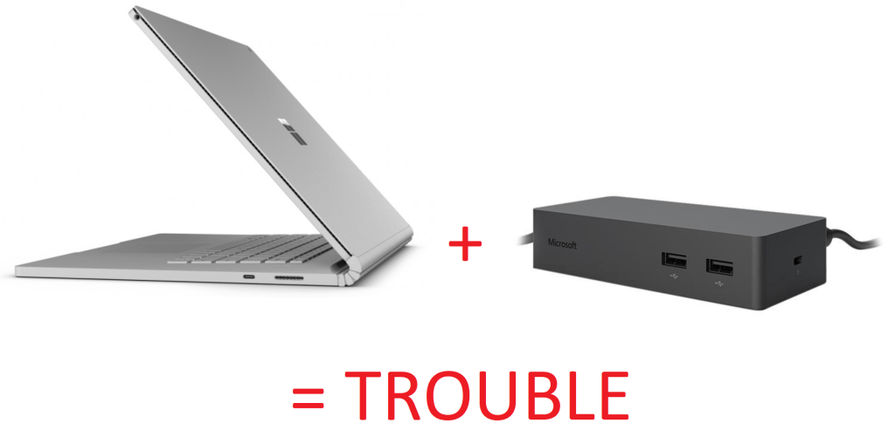
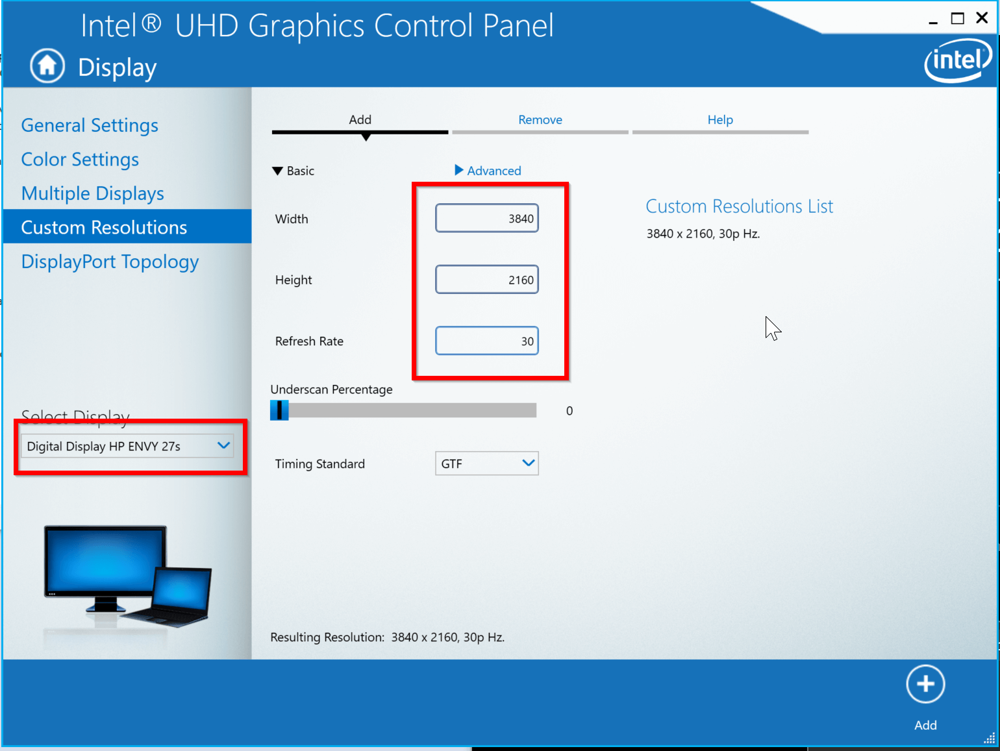

I recently got a new job at Microsoft (yay!) and with that came a new computer to get integrated into my workflow. I have been using a Surface Pro 4 hooked up to two HP Envy 27s 4K monitors to get a lot of pixel real estate in not a whole lot of desk area space. I got a 13″ Surface Book 2 (I7) for my new job and was wanting to integrate it with my current monitor setup.

However…

Needless to say, my Surface Book 2 didn’t drive my 4K monitors out of the box. I was connecting with Mini-DiplayPort to DisplayPort cables and the best resolutions I could get out of either monitor was 2560×1600 pixels (even with the laptop screen off).  What’s going on here?!

There isn’t much “official” documentation on this issue, just responses forums. The general conclusion is though the Surface Book 2 has both integrated and dedicated graphics cards, only the integrated Intel graphics chip is driving external monitors. When you’re only displaying via external monitors the discrete graphics card is essentially unused.

According to this [Microsoft site](https://support.microsoft.com/en-us/help/4039635/connect-surface-to-a-tv-display-or-projector), dual 4K monitors should work at 30Hz. My monitors would not go lower than 60Hz in the monitor properties dialog so I was stuck.

But THERE IS HOPE.

So the “best” fix for image quality (i.e. if you’re wanting 60Hz refresh rate) is to simply get a USB based 4K display adapter to augment the Surface Dock (something like [this](https://www.amazon.com/dp/B00NI96S2O/ref=asc_df_B00NI96S2O1527937200000?tag=shopz0d-20&ascsubtag=shopzilla_mp_1108-20&15331094461122356976610080301008005&creative=395261&creativeASIN=B00NI96S2O&linkCode=asn)). If you can live with 30Hz refresh rate you can “force” that display mode. Here’s how:

1. Download the Intel Display Management software from [here](https://www.intel.com/content/www/us/en/support/products/126789/graphics-drivers/graphics-for-8th-generation-intel-processors/intel-uhd-graphics-620.html). Install it.
2. From the Intel Graphics Control Panel, navigate to “Display -> Custom Resolutions”.
3. For each monitor, enter the optimal resolution with a 30Hz refresh rate (like this).

4. Reboot your computer.
5. Go back into the Intel Management Software and change your resolution to your newly defined custom resolution for each monitor (it’s under general settings).

BOOM. Just like that you can rock dual 4K monitors with the Surface Brick Dock. I haven’t had any eye strain from the 30Hz refresh rate, but your milage may vary depending on your pickiness and monitors.

I’m calling it a day, I hope my #winning can help you out.

(P.S. [This site](https://dancharblog.wordpress.com/2014/12/20/multi-monitor-docking-with-surface-pro-3-and-lenovo-yoga-3-pro/) was a godsend through my plight. Kudos)