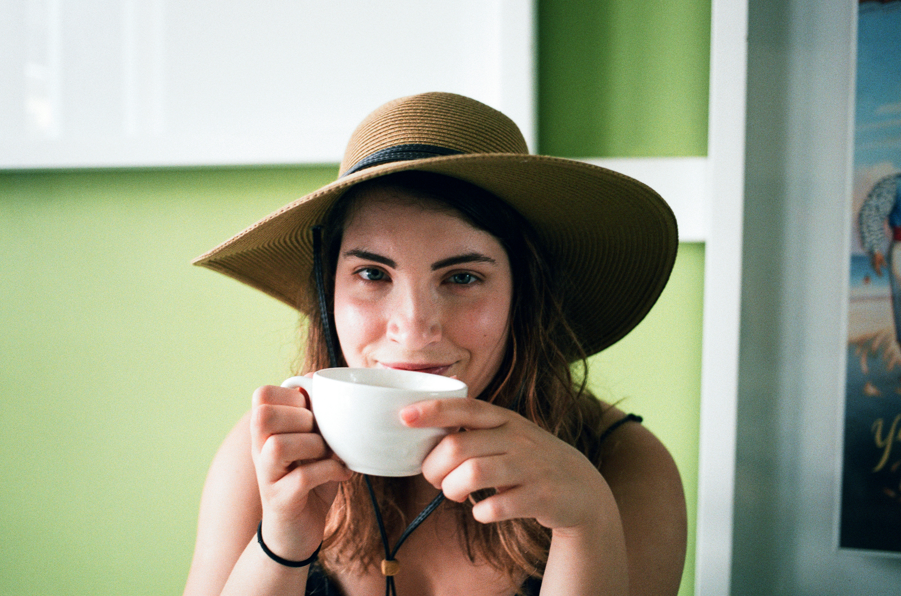
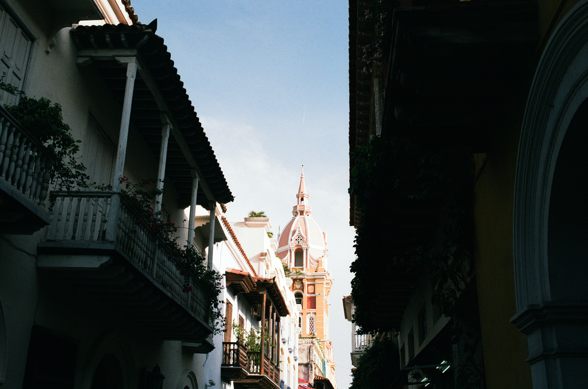
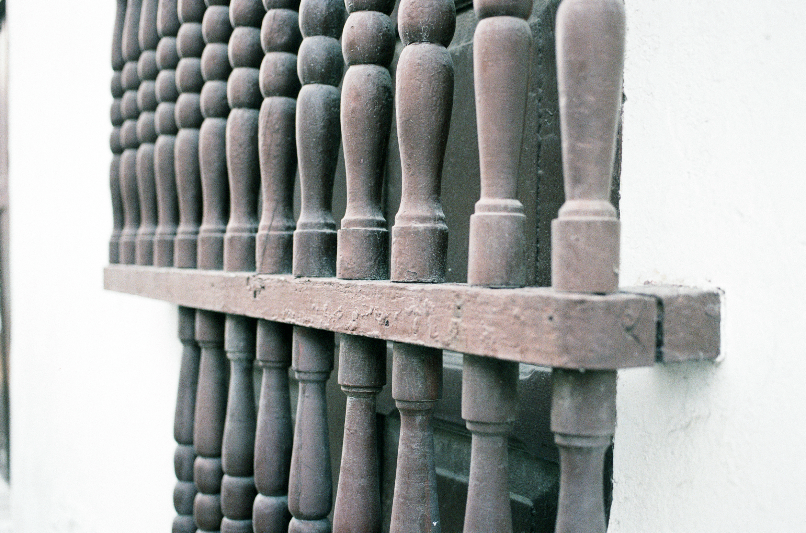
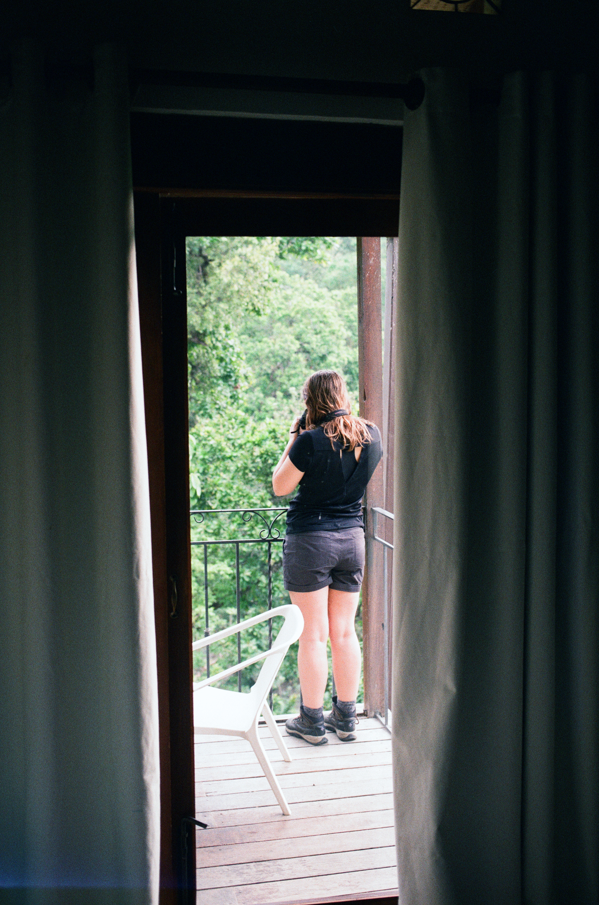
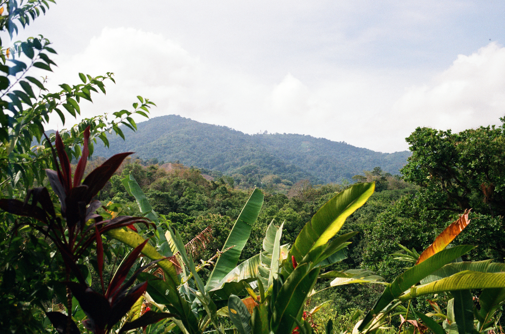
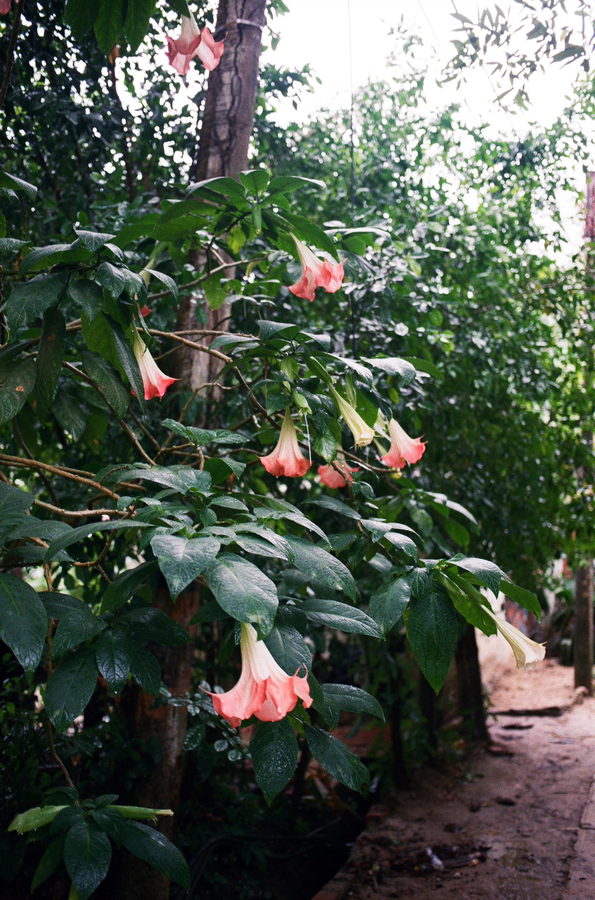
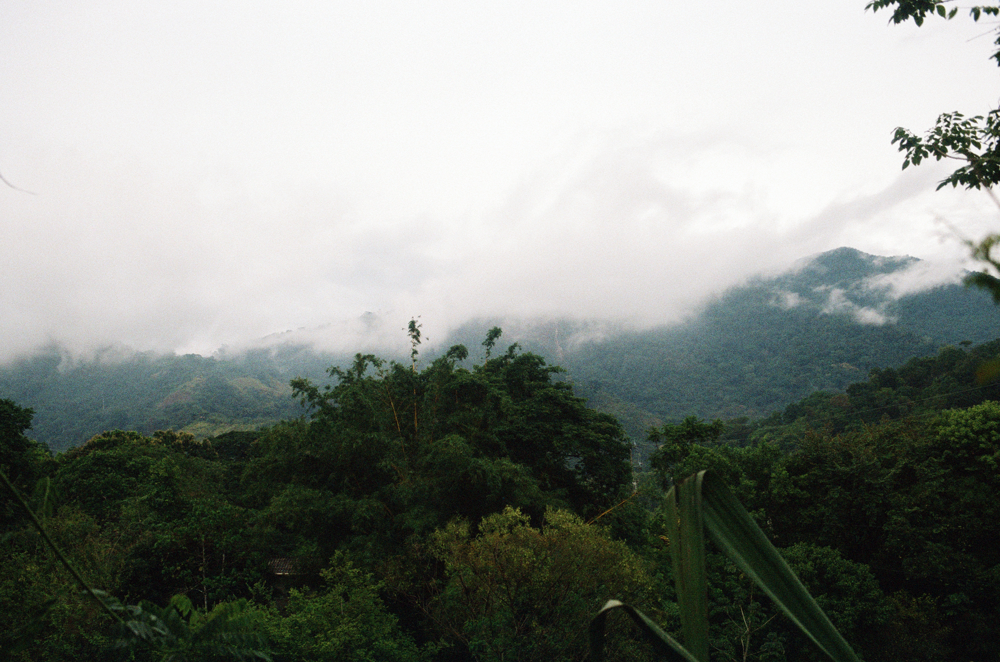
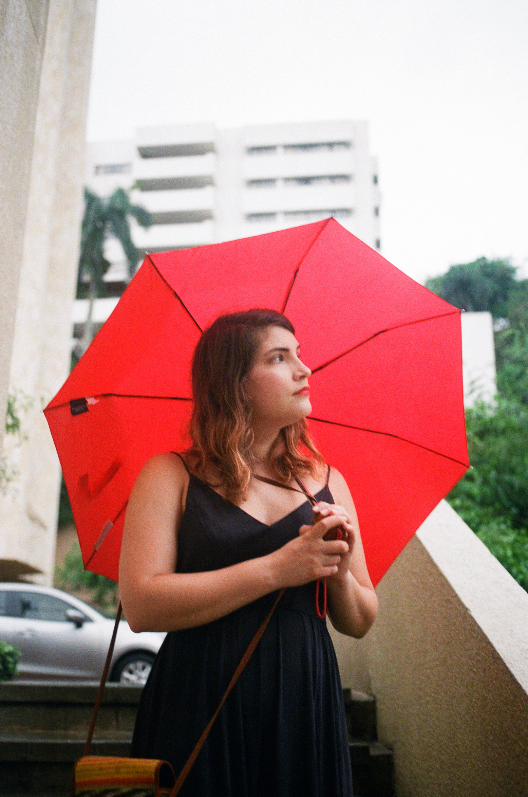
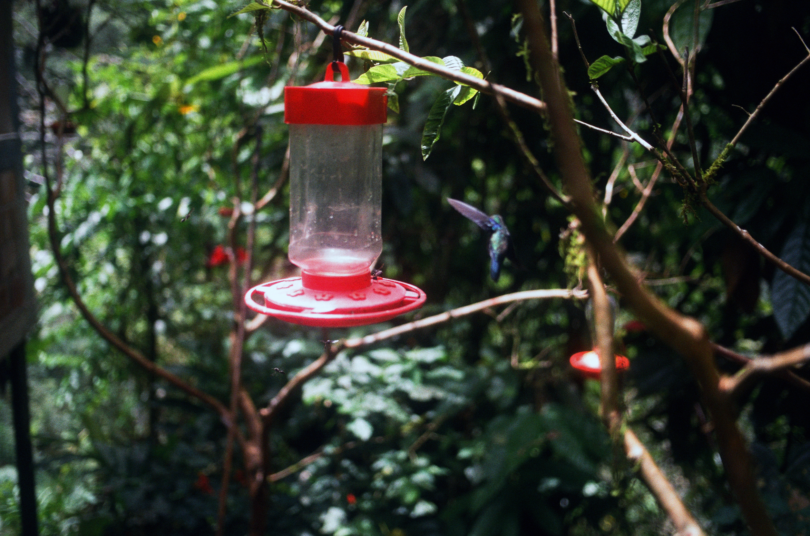
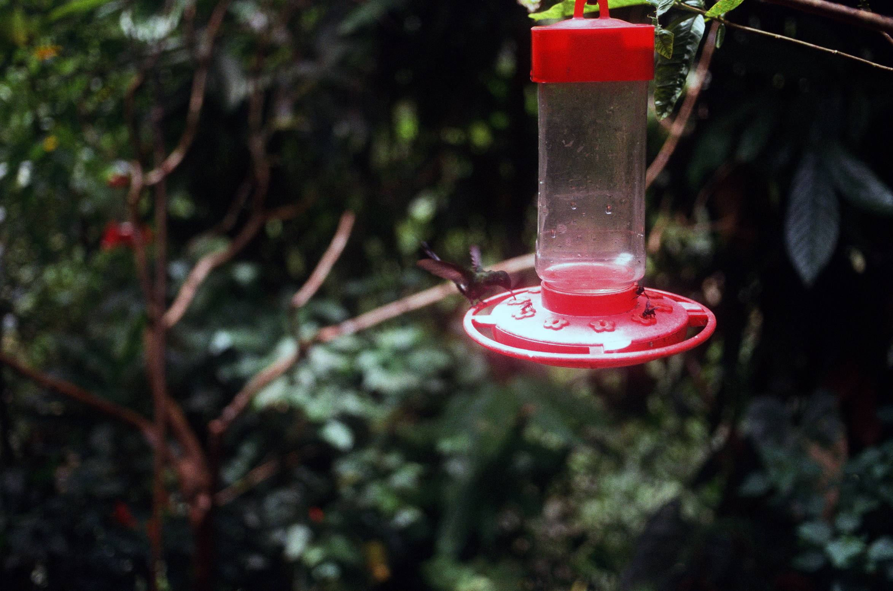

Whew! 2018 has been a crazy year so far but my long and planned out trip was to Colombia for two weeks with my fiancee Katy. Columbia is giant country (about halfway between the size of Texas and Alaska) so we decided to focus out time up north (in Cartagena and Minca) and on a road trip on the west side (from Cal to Medellin).

The trip was epic. I saw 259 different species of birds over the two weeks. I got to drive through landslides. The food was amazing. The people were kind. The coffee, oh the coffee (especially the cafe en aguapanela) was amazing even from people selling it on the street from thermoses in their carts. We were blown away by Colombia, it may even be my most favorite place I've been.

While I wanted to bring my medium format camera, we only carried our luggage on our backs for the whole two week trip so space was VERY limited. I stuck with the trusty Canon EOS 3. My favorite local shop, [Blue Moon Camera](https://www.bluemooncamera.com/), received their last shipment of Agfa Vista since it has been discontinued and I decided to try it out in Colombia.

**Camera**: Canon EOS 3
**Film**: Agfa Vista 200 (35mm)

CARTAGENA

We started out in Cartagena! The touristy section is a beautiful, colonial inspired walled city.

 

 

The whole area is colorful like this!

MINCA

Next we went up to Minca for some bird watching. The Sierra Nevada mountain area has over 1/4 of the endemic birds of Colombia.

 

 

I became obsessed with trying to capture a humming bird on film mainly because Katy was trying out her new Sony cameras on birds.

 

Katy's aunt and uncle loaned us this book for reference on our trip. Although we carried on all our luggage, this made the cut and was worth it's weight in gold (until we found a new book in Cali).

 

Club Colombia was a great, local cheap beer.

 

The textures through the fence looked better in person&#8230;

Memorized by the fog. 😍

CALI

Cleaned up for Cali! We love going from bird watching to nice, city scenes.

 

 

We went to the Modern Art museum in Cali. This was taken outside.

 

 

We stopped by a place called Nora's with humming bird and tanager feeders. Reminder – all these were taken with a 40mm. This is how close I were to them.

The Afga has an interesting effect with the brilliant reds on the feeders.

 

 

Creeping on Katy in the jungle.

 

We asked our guide to take a photo. In the future I'll focus and leave it on manual.

BUGA

After one night in Buga, we went to Laguna El Sonso. There was lichen hanging from trees EVERYWHERE!!!

The Renault Duster, one of my favorite cars, was out transport for 8 days. I had to take a photo!

 

Dreamy lichen shot. For the second one, I tried to hold some lichen in front of the camera.

